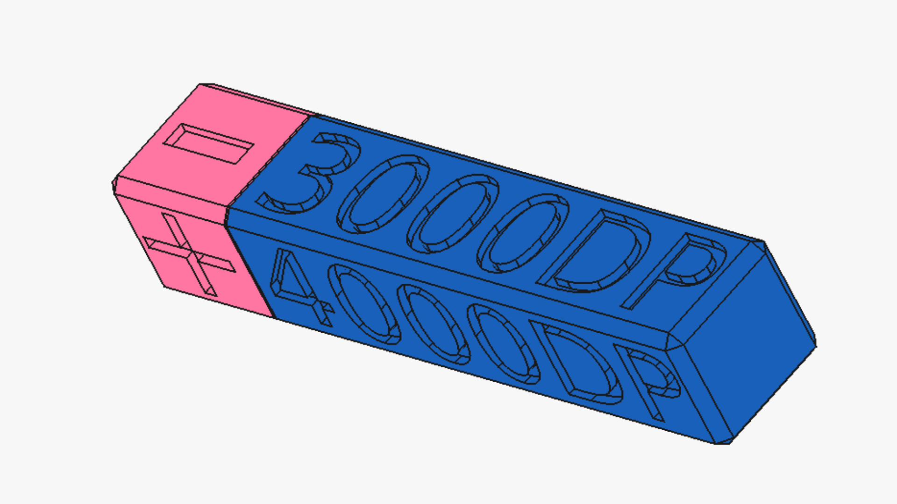
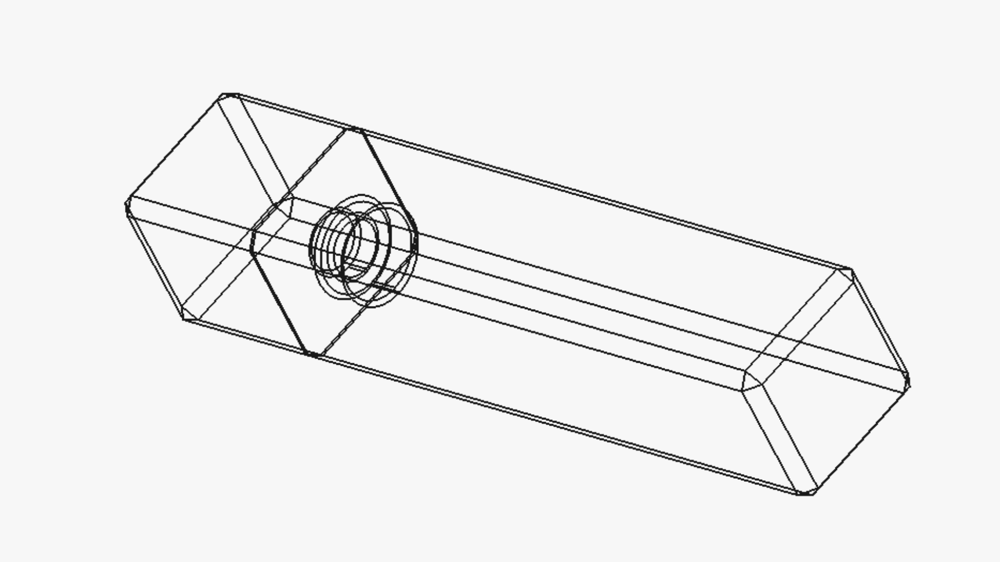
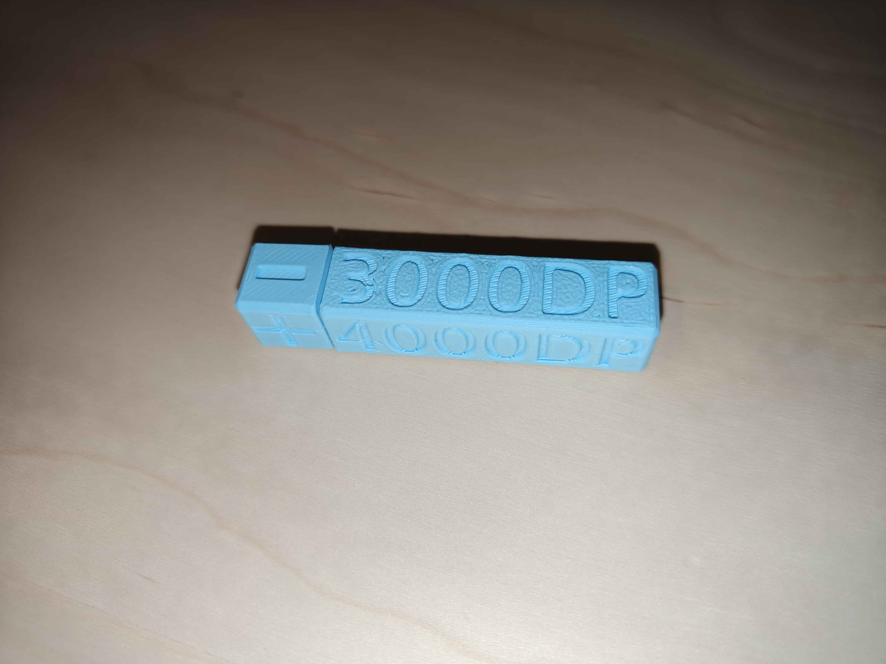
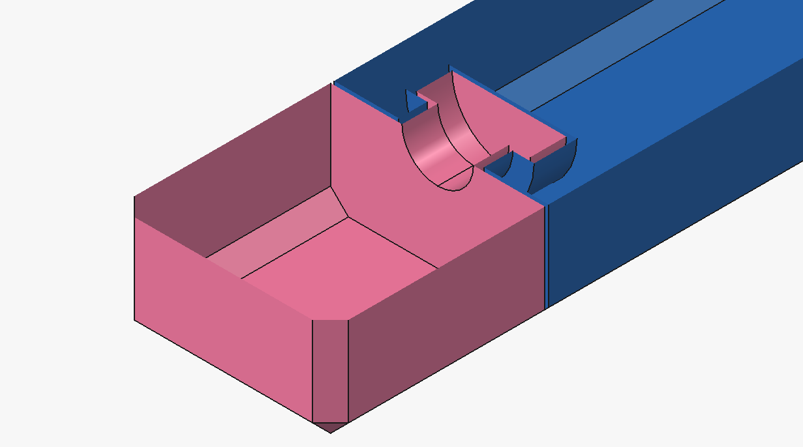

# Digimon-Counters
Digimon TCG Counters (for now only DP +/- is available)

Print in place design (knob/rotary mechanism).

Files are provided as both, STL and 3mf.

If the 3mf file is used, import as "single object with multiple parts".

## Designed with FreeCAD

Source provided in the [files](./files) directory (FCStd file).

## Images

## Printing/recommendations/notes

Only tested/used the Bambulab P1S printer with PLA Matte from Sunlu.

Regarding the colours to use, I believe matter would be best, at latest from my experience/the few colours I managed to get hold of.

Printing it flat instead of standing worked fine/without issues.

Rotating the knob feels smooth/with barely any friction, yet the clearance value is set to 0.3mm in the spreadsheet, it can be modified in the spreadsheet.

Used a single colour due to time/cost efficiency, but slicers (such as OrcaSlicer) allow for coloring stuff.

## Mechanism

Just a protrusion.

## Other Counters?

Would like to do more in the future (now that I have a base to work on).

Feel free to request something, as otherwise I will only bother when I need them.

## License

Shield: [![CC BY-NC-SA 4.0][cc-by-nc-sa-shield]][cc-by-nc-sa]

This work is licensed under a
[Creative Commons Attribution-NonCommercial-ShareAlike 4.0 International License][cc-by-nc-sa].

[![CC BY-NC-SA 4.0][cc-by-nc-sa-image]][cc-by-nc-sa]

[cc-by-nc-sa]: http://creativecommons.org/licenses/by-nc-sa/4.0/
[cc-by-nc-sa-image]: https://licensebuttons.net/l/by-nc-sa/4.0/88x31.png
[cc-by-nc-sa-shield]: https://img.shields.io/badge/License-CC%20BY--NC--SA%204.0-lightgrey.svg